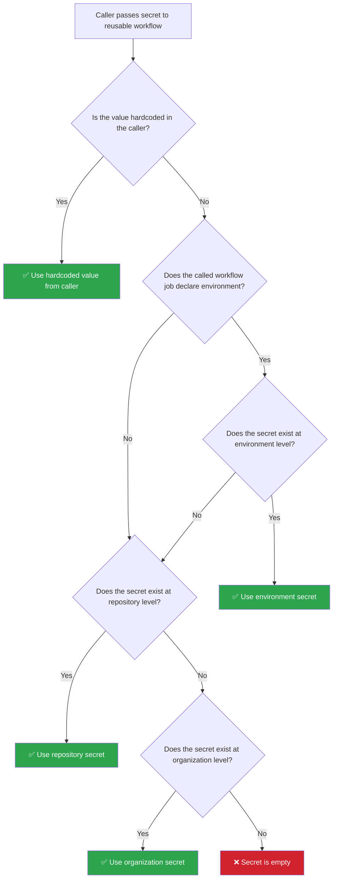
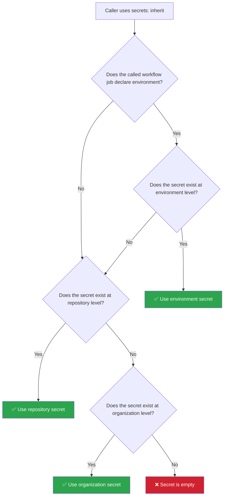

# GitHub Secrets: Permission Lifting & Precedence in Reusable Workflows

This repository demonstrates how **secrets isolation**, **permission lifting**, and **secret precedence** work in GitHub Actions reusable workflows (`workflow_call`).

## Key Concepts

### 1. Secrets Isolation in Reusable Workflows

By default, reusable workflows are **sandboxed** — they cannot access any secrets from the caller, even if the secret exists at the repository or environment level. This is a security-by-design decision by GitHub to prevent untrusted reusable workflows from silently accessing sensitive data.

>[!IMPORTANT]
> This isolation applies only to **secrets** (`secrets.*`). Environment **variables** (`vars.*`) are **not isolated** and are automatically accessible when the job declares an `environment:`.

### 2. Lifting Secret Isolation

There are two ways to lift the secret isolation and grant a reusable workflow access to secrets:

#### Option A: Explicit Secret Passing

The caller explicitly maps each secret to the called workflow. The caller can either forward a secret reference or hardcode a value:

```yaml
jobs:
  call-reusable:
    uses: ./.github/workflows/reusable_workflow.yaml
    with:
      github_environment: dev
    secrets:
      GH_ENV_SECRET_ONLY: ${{ secrets.GH_ENV_SECRET_ONLY }}         # Forward secret reference
      SECRET_AT_REPO_AND_GH_ENV_LEVELS: ${{ secrets.SECRET_AT_REPO_AND_GH_ENV_LEVELS }}
      SECRET_OVERRIDE_BY_VALUE: "CallerWorkflow"                     # Hardcode a value
```

With explicit passing:
- The called workflow must **declare** each secret it expects under `on.workflow_call.secrets`.
- The caller controls exactly which secrets are shared — **principle of least privilege**.
- The caller can **override** a secret's value by hardcoding it (e.g., `"CallerWorkflow"`).

>[!NOTE]
> When the caller writes `GH_ENV_SECRET_ONLY: ${{ secrets.GH_ENV_SECRET_ONLY }}`, it does **not** pass the actual value if the secret only exists at the environment level and the caller job has no `environment:` set. Instead, it **lifts the isolation**, allowing the called workflow to resolve the secret from its own `environment:` declaration.

The following diagram illustrates how a secret is resolved when using explicit passing:



#### Option B: `secrets: inherit`

The caller grants blanket access to all secrets:

```yaml
jobs:
  call-reusable:
    uses: ./.github/workflows/reusable_workflow_with_inherit.yaml
    with:
      github_environment: dev
    secrets: inherit
```

With `secrets: inherit`:
- The called workflow does **not** need to declare secrets under `on.workflow_call.secrets`.
- **All** secrets from organization, repository, and environment levels become available.
- The caller **cannot override** individual secret values — it's all-or-nothing.

The following diagram illustrates how a secret is resolved when using `secrets: inherit`:



### 3. Secret Precedence

When a secret with the same name exists at multiple levels, GitHub resolves it using this precedence order (highest to lowest):

| Priority | Source | Description |
|----------|--------|-------------|
| 1 (highest) | **Caller hardcoded value** | Value explicitly set in the caller (e.g., `SECRET: "CallerWorkflow"`) |
| 2 | **Environment secret** | Secret defined in the GitHub environment, when the job has `environment:` set |
| 3 | **Repository secret** | Secret defined at the repository level |
| 4 (lowest) | **Organization secret** | Secret defined at the organization level |

#### Precedence Rules:
- **Environment secrets override repository secrets** when the job declares `environment:`.
- **Caller hardcoded values override everything**, because the called workflow receives the literal value instead of a reference.
- **Without `environment:`** on the job, environment-level secrets are inaccessible, and the repository-level value is used instead.

### 4. Variables vs Secrets

| Aspect | `vars.*` (Variables) | `secrets.*` (Secrets) |
|--------|---------------------|----------------------|
| Sensitivity | Non-sensitive configuration | Sensitive credentials |
| Visible in logs | Yes (printed as-is) | No (masked with `***`) |
| Isolated in reusable workflows | **No** — available automatically | **Yes** — requires `inherit` or explicit passing |
| Accessed via `environment:` | Automatically, no lifting needed | Only after isolation is lifted |

## Repository Structure

This repository contains three workflow files that demonstrate these concepts:

### [`test_workflow.yaml`](.github/workflows/test_workflow.yaml) — Caller Workflow

The entry point. Dispatched manually with a `github_environment` input. It calls two reusable workflows:
1. **Without inherit** — passes secrets explicitly, including one hardcoded override.
2. **With inherit** — uses `secrets: inherit` for blanket access.

### [`reusable_workflow.yaml`](.github/workflows/reusable_workflow.yaml) — Explicit Secrets

Declares required secrets under `on.workflow_call.secrets`. Tests:
- `GH_ENV_SECRET_ONLY` — exists only at environment level
- `SECRET_AT_REPO_AND_GH_ENV_LEVELS` — exists at both repo and environment level (environment wins)
- `SECRET_OVERRIDE_BY_VALUE` — overridden by hardcoded value from caller ("CallerWorkflow" wins)
- A second job **without `environment:`** to show that repo-level secrets are used when no environment is set.

### [`reusable_workflow_with_inherit.yaml`](.github/workflows/reusable_workflow_with_inherit.yaml) — Inherited Secrets

Does **not** declare secrets. Tests the same scenarios but with `secrets: inherit`:
- All secrets are accessible without explicit declaration.
- `SECRET_OVERRIDE_BY_VALUE` is **not** overridden (no hardcoded value), so the environment value is used.
- A second job **without `environment:`** to show repo-level fallback.

## Test Scenarios & Expected Results

Assuming the following secret configuration:

| Secret Name | Organization | Repository | Environment (`dev`) |
|-------------|-------------|------------|---------------------|
| `GH_ENV_SECRET_ONLY` | — | — | `Environment` |
| `SECRET_AT_REPO_AND_GH_ENV_LEVELS` | — | `Repository` | `Environment` |
| `SECRET_OVERRIDE_BY_VALUE` | — | — | `Environment` |

### Expected Results — Explicit Passing (no inherit)

| Secret | With `environment: dev` | Without `environment:` |
|--------|------------------------|----------------------|
| `GH_ENV_SECRET_ONLY` | `Environment` | N/A |
| `SECRET_AT_REPO_AND_GH_ENV_LEVELS` | `Environment` (env overrides repo) | `Repository` |
| `SECRET_OVERRIDE_BY_VALUE` | `CallerWorkflow` (hardcoded overrides env) | N/A |

### Expected Results — `secrets: inherit`

| Secret | With `environment: dev` | Without `environment:` |
|--------|------------------------|----------------------|
| `GH_ENV_SECRET_ONLY` | `Environment` | N/A |
| `SECRET_AT_REPO_AND_GH_ENV_LEVELS` | `Environment` (env overrides repo) | `Repository` |
| `SECRET_OVERRIDE_BY_VALUE` | `Environment` (no hardcoded override) | N/A |

## When to Use Which Approach

>[!IMPROTANT]
> **Recommendation:** Following the **principle of least privilege**, it is recommended to **explicitly declare and pass secrets** to reusable workflows rather than using `secrets: inherit`. This ensures each workflow only has access to the secrets it actually needs, reducing the blast radius in case of a compromised or misconfigured workflow.

| Scenario | Recommended Approach |
|----------|---------------------|
| Called workflow resolves its own environment secrets | `secrets: inherit` |
| Internal/trusted reusable workflows | `secrets: inherit` (simpler) |
| Third-party/external reusable workflows | Explicit passing (safer) |
| Need to override a secret value | Explicit passing (only option) |
| Security-critical pipelines | Explicit passing (least privilege) |

## References

- [Using secrets in GitHub Actions](https://docs.github.com/en/actions/security-for-github-actions/security-guides/using-secrets-in-github-actions)
- [Reusing workflows](https://docs.github.com/en/actions/sharing-automations/reusing-workflows)
- [Passing secrets to reusable workflows](https://docs.github.com/en/actions/sharing-automations/reusing-workflows#passing-inputs-and-secrets-to-a-reusable-workflow)
- [Using environments for deployment](https://docs.github.com/en/actions/managing-workflow-runs-and-deployments/managing-deployments/using-environments-for-deployment)
- [Variables in GitHub Actions](https://docs.github.com/en/actions/writing-workflows/choosing-what-your-workflow-does/variables)